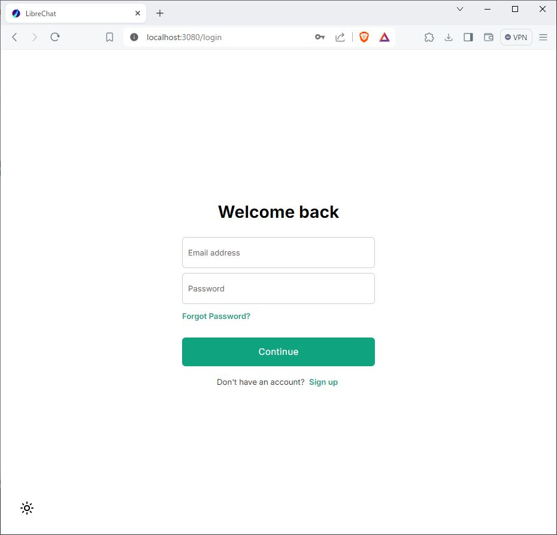
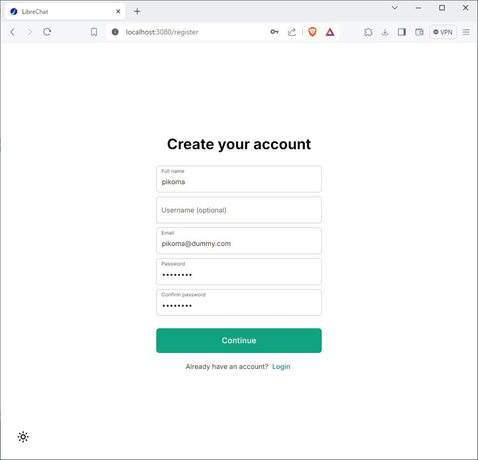
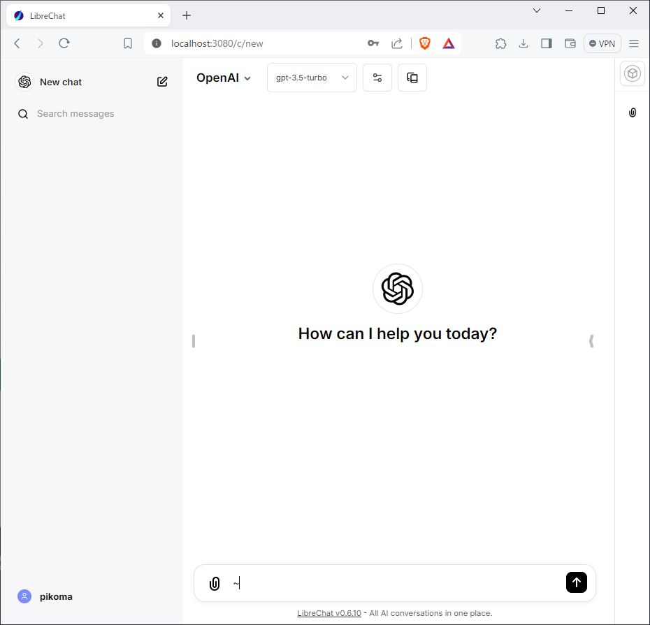

# WindowsでLLM
# LibreChat編

Chat UIでローカルChatGPTっぽい環境を構築する。  
UIは[LibreChat](https://github.com/danny-avila/LibreChat)を使用し、llama-cpp-pythonサーバのLLMにOpenAI API設定で接続する手順。  

## はじめに
- [LibreChat](https://github.com/danny-avila/LibreChat)は、ChatGPTに似たWeb UIの実装。
- かなり多機能ため、シンプルにllama-cpp-pythonサーバと接続するための手順。
- [WSL/llama-cpp-python編](../1.WSL_llamacpp)で、WSL、llama-cpp-pythonの環境が構築済みであること


## LibeChat

### インストール
[LibreChat](https://github.com/danny-avila/LibreChat)のGitからコピーし、設定ファイルのサンプル`.env.example`を`.env`にコピーする。
```
git clone https://github.com/danny-avila/LibreChat.git
cd LibreChat
cp .env.example .env ## 設定ファイル
```

`.env`を修正する。  
以下のパラメータをセットする。
LLMの接続先は、`http://host.docker.internal:8080`としDockerコンテナ内からホスト上のサービスに接続する。
```
ENDPOINTS=openAI
PROXY=
OPENAI_API_KEY=None
#DEBUG_OPENAI=true ## 必要に応じて

OPENAI_MODELS=gpt-3.5-turbo
OPENAI_TITLE_MODEL=gpt-3.5-turbo
OPENAI_REVERSE_PROXY=http://host.docker.internal:8080 ## Dockeのコンテナなので
```

### 起動

```
docker compose up
```
Dockerで3つのプロセスが走る。
- librechat: 1.42GB
- mongo: 756MB
- meilisearch: 147MB
  
### Web UIにアクセスする
Windows上のブラウザから、以下のURLにアクセスするとログイン画面が表示される。
`http://localhost:3080/`



#### アカウント作成
ユーザアカウントを作成する。  
今回は特別な認証を設定していないため、自由にアカウントを作成できる。

ログイン画面で、`Don't have an account? Sign up`をクリックし、`Create your account`画面に移行する。

`Full name`, `Email`, `Password`, `Confirm password`を設定する。  
`Email`がログイン名になる。実在しないメールアドレスで、適当に設定できる。


ログイン後、チャット画面になる。


### 停止
```
docker compose down
```

`^C`でも止まるが、Docker終了プロセスは残る。
```
docker ps --all
docker rm
```


### 課題
- LLMの回答終了後もCPU負荷が下がらない  
  負荷が下がるまで入力できない。  
  LibreChatが何かしてる？    原因不明（調査中）  
- チャットを続けると、どんどん遅くなっていく  
  Chat APIは過去の履歴を含んで問い合わせるため、質問文が長くなっていき、処理量が増大していくため。


## Chat Completions
OpenAI APIでチャット会話をする方法。

チャットは過去の話の流れを考慮した会話が出来るが、実際は過去の会話履歴も含めてLLMに問い合わせている。  
このため、会話が長くなるほど、入力文章が長くなり、処理に時間がかかる。  
また、入出力の合計token数がmax_tokensを超えないように注意する必要がある。  

以下のように、過去の履歴として`role:user`と`role:assistant` を交互に続けて入力する。  
```python
messages=[
    {"role": "system", "content":  "システムプロンプト"},
    {"role": "user", "content": "ユーザの質問1"},
    {"role": "assistant", "content": "LLMの回答1"},
    {"role": "user", "content": "ユーザの質問2"},
],
```

サンプルコード
```python
from openai import OpenAI

client = OpenAI(
    base_url='http://localhost:8080/v1', ## Endpoint
    api_key='Dummy' ## Dummy Key
)

model = 'gpt-3.5-turbo' ## LLM Model Name

system = 'あなたは優秀な日本の観光ガイドです。' ## システムプロンプト
prompt = '"東京の観光名所を３つ教えてください。' ## 質問文

response = client.chat.completions.create(
    model=model, ## Model Name
    max_tokens=4096, ## 最大トークン数
    temperature=0.01,
    top_p=0.01,
    messages=[
        {"role": "system", "content": "あなたは優秀な日本の観光ガイドです。"},
        {"role": "user", "content": "東京の観光名所を３つ教えてください"},
        {"role": "assistant", "content": """承知しました。東京にはたくさんの観光スポットがありますが、ここでは三つをご紹介します: 

1. 東京スカイツリー: 2012年に開業した東京スカイツリーは、東京都有形文化財に指定されているタワービルのひとつです。高さ378mあり、展望台からは東京の街並みや富士山などを一望することができます。

2. 東京タワー: 1958年に開業した東京タワーは、日本初の本格的な電波塔として有名です。高さ333mあり、展望台からは東京の街並みやレインボーブリッジなどを一望することができます。

3. 東京国立博物館: 1959年に開業した東京国立博物館は、日本最古で最大級の美術館の一つです。国宝や重要文化財を含む約110,000点もの美術品を収蔵しており、そのコレクションは世界的に有名です。"""},
        {"role": "user", "content": "他にお勧めはありますか？"},
    ],
    stream=True, ## Streaming output
)

# Streaming output
for chunk in response:
    s = chunk.choices[0].delta.content
    ## 最初と最後にNoneが入るため除外（理由不明）
    if s is not None:
        print(s, end='')
```
回答
```
はい、他にもおすすめの観光スポットはありますが、ここでは3つほどご紹介します:

1. 東京駅: 2012年に開業した新幹線ホームやグランスタなどの商業施設を備えた東京駅は、日本の代表的な駅の一つです。

2. 皇居: 1945年以降は現天皇の住まいである皇居は、日本で最も有名な観光スポットの一つです。

3. 明治神宮: 1920年に創建された明治神宮は、平和と幸運を願う人々の祈りの場として知られています。
```


<hr>

LLM実行委員会