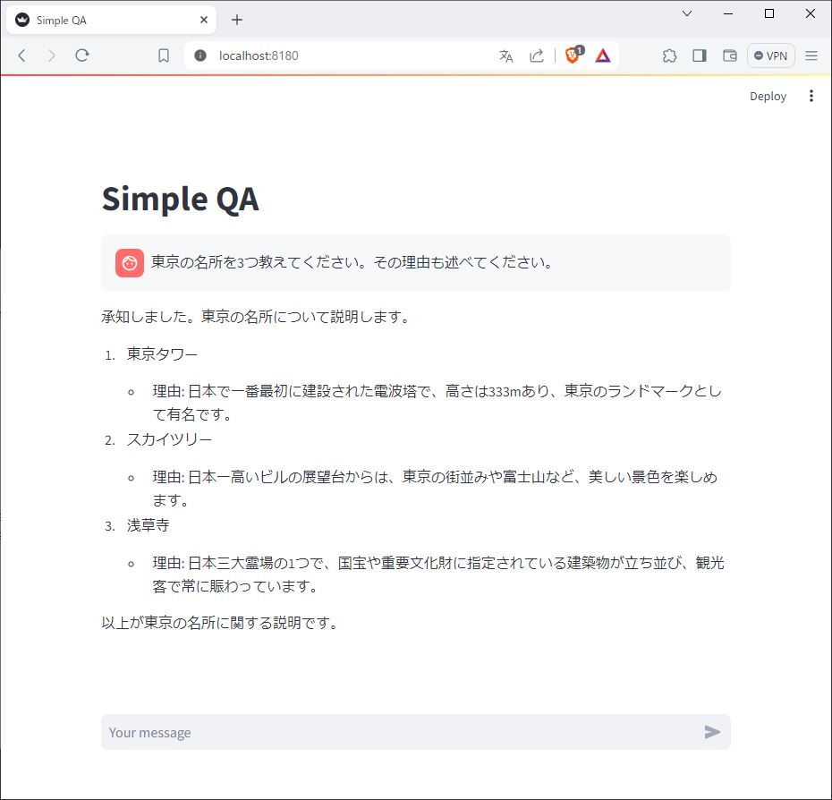
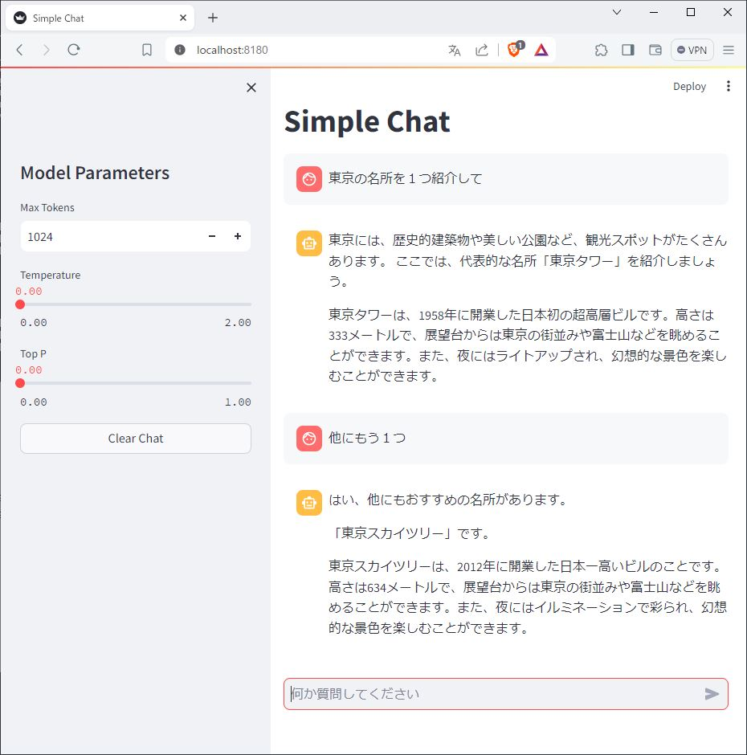

# WindowsでLLM
# Streamlit Chat編

PythonのWebアプリフレームワークである、Streamlitを使って、簡単なチャットWebアプリを作成する。LLMはOpenAI APIで、llama-cpp-pythonサーバに問い合わせる。


## はじめに
### Streamlitとは
PythonでWebアプリを簡単に作成できるオープンソースフレームワークで、Webサーバとして動作しブラウザからWebアプリが使用できる。  
Chat用の部品も用意されており、簡単にチャットアプリを作成することが出来る。

### 参考
- [Streamlit documentation](https://docs.streamlit.io/)  
- [Chat elements](https://docs.streamlit.io/library/api-reference/chat)  
- [Build a basic LLM chat app](https://docs.streamlit.io/knowledge-base/tutorials/build-conversational-apps)  

<hr>


### インストール

`streamlit`パッケージを入れる。
```bash
conda install streamlit
```

### 実行方法

実行はstreamlitコマンドでpythonコード`.py`を指定する形となる（Jupyterから実行はできない）。  

例： `simple_chat.py`をポート`8180`で起動する場合
```
$ streamlit run simple_chat.py --server.port 8180
```

初回起動時、`Email`を聞かれるが、リターンキーでスルーする。
```
      👋 Welcome to Streamlit!

      If you’d like to receive helpful onboarding emails, news, offers, promotions,
      and the occasional swag, please enter your email address below. Otherwise,
      leave this field blank.

      Email:
```

その後、URLが表示されたら起動完了。ブラウザでそのURLにアクセスすると、Webアプリが表示される。
```
  You can find our privacy policy at https://streamlit.io/privacy-policy

  Summary:
  - This open source library collects usage statistics.
  - We cannot see and do not store information contained inside Streamlit apps,
    such as text, charts, images, etc.
  - Telemetry data is stored in servers in the United States.
  - If you'd like to opt out, add the following to ~/.streamlit/config.toml,
    creating that file if necessary:

    [browser]
    gatherUsageStats = false


  You can now view your Streamlit app in your browser.

  Local URL: http://localhost:8180
  Network URL: http://172.22.66.66:8180
```

### LLMサーバ
OpenAI API形式でLLMにアクセスするため、あらかじめLLMサーバを起動しておく。  
以下はllama-cpp.serverでElyzaを起動する例。
```bash
python -m llama_cpp.server --model ELYZA-japanese-Llama-2-7b-fast-instruct-q4_K_M.gguf --chat_format llama-2 --n_gpu_layers 0 --port 8080 --host 0.0.0.0
```

<hr>

## Simple QA



もっともシンプルなOpenAI APIを使ったQAアプリ。１問1答形式で、過去の文脈は含まない簡素な問合せ。


Source: [simple_qa.py](simple_qa.py)
```python
from openai import OpenAI
import streamlit as st

## 基本設定
base_url = 'http://localhost:8080/v1' ## LLM先(llama-cpp.server)
api_key = 'Dummy' ## Dummy Key 何でも良い
model = 'gpt-3.5-turbo' ## LLM Model Name: gpt-3.5-turbo, text-davinci-003

system = 'あなた日本語の優秀なアシスタントです。' ## システムプロンプト
max_tokens = 1024 ## 生成するトークンの最大数
temperature = 0.0 ## 0～2 直が高いほど多様性が高まる（確率の低い値も選択範囲に入る）
top_p = 0.0 ## 0～1 確率が高い順に上位何%を選択範囲に入れるか
frequency_penalty = 0.0 ## -2～2 モデルが同じ行を逐語的に繰り返す可能性を低下させる
presence_penalty = 0.0 ## -2～2 モデルが新しいトピックについて話す可能性を高める
seed = 0 ## 乱数の初期値 出力結果を一定にする

## サーバと接続
openai = OpenAI(
    base_url=base_url, ## Model Name
    api_key=api_key ## Dummy Key
)

## Streamit GUI
st.set_page_config(page_title='Simple QA') ## ページタイトル
st.title("Simple QA") ## タイトル

## 初期設定
if "messages" not in st.session_state:
    st.session_state["messages"] = []
    ## [{"role": "assistant", "content": "何か気になることはありますか？"}]

if prompt := st.chat_input():
    ## 入力後の処理
    openai = OpenAI(
        base_url=base_url, ## Model Name
        api_key=api_key ## Dummy Key
    )
    st.session_state.messages.append({"role": "user", "content": prompt}) ## 入力値の追加
    st.chat_message("user").write(prompt) ## 入力値の表示

    ## OpenAI API ChatCompletion
    stream = openai.chat.completions.create(
        model=model, max_tokens=max_tokens, temperature=temperature, top_p=top_p, seed=seed,
        frequency_penalty=frequency_penalty, presence_penalty=presence_penalty,
        messages=st.session_state.messages, ## Streamlitから
        stream=True, ## Streaming output
    )

    res_area = st.empty() ## 画面クリア
    response = st.write_stream(stream) ## Stremlitのストリーミング表示機能
```


<hr>

## Simple Chat



過去の文脈も考慮した、一般的なChatアプリ。サイドバーで、パラメータの調整とチャットのクリアボタンを備える。


Source: [simple_chat.py](simple_chat.py)
```python
from openai import OpenAI
import streamlit as st

base_url = 'http://localhost:8080/v1' ## LLM先(llama-cpp.server)
api_key = 'Dummy' ## Dummy Key 何でも良い
model = 'gpt-3.5-turbo' ## LLM Model Name: gpt-3.5-turbo, text-davinci-003

system = 'あなた日本語の優秀なアシスタントです。'
max_tokens = 1024 ## 生成するトークンの最大数
temperature = 0.0 ## 0～2 直が高いほど多様性が高まる（確率の低い値も選択範囲に入る）
top_p = 0.0 ## 0～1 確率が高い順に上位何%を選択範囲に入れるか
frequency_penalty = 0.0 ## -2～2 モデルが同じ行を逐語的に繰り返す可能性を低下させる
presence_penalty = 0.0 ## -2～2 モデルが新しいトピックについて話す可能性を高める
seed = 0 ## 乱数の初期値 出力結果を一定にする

## サーバと接続
openai = OpenAI(
    base_url=base_url, ## Model Name
    api_key=api_key ## Dummy Key
)

## Streamit GUI
st.set_page_config(page_title='Simple Chat')  ## ページタイトル
st.title('Simple Chat') ## タイトル

## サイドバー
st.sidebar.markdown('# Model Parameters')
max_tokens = st.sidebar.number_input('Max Tokens', 0, 4096, max_tokens, step=256) ## Max Tokens
temperature = st.sidebar.slider('Temperature', 0.0, 2.0, temperature, 0.1) ## Temperature
top_p = st.sidebar.slider('Top P', 0.1, 1.0, top_p, 0.1) ## Top P
if st.sidebar.button('Clear Chat', use_container_width=True): ## Clear Chat Button
    ## 画面と履歴のクリア
    print('Clear Chat')
    st.session_state.messages = [] ## これで履歴も消える！！
    
## 初期設定
if 'openai_model' not in st.session_state:
    st.session_state['openai_model'] = model

if 'messages' not in st.session_state:
    st.session_state.messages = []
    # st.session_state.messages.append({"role": "system", "content": system}) ## システムプロンプトを使う場合

for message in st.session_state.messages:
    with st.chat_message(message['role']):
        st.markdown(message['content'])

if prompt := st.chat_input('何か質問してください'):
    ## 入力後の処理
    st.session_state.messages.append({'role': 'user', 'content': prompt})
    with st.chat_message('user'):
        st.markdown(prompt)

    ## OpenAI API ChatCompletion
    with st.chat_message('assistant'):
        stream = openai.chat.completions.create(
            model=st.session_state['openai_model'],
            max_tokens=max_tokens, temperature=temperature, top_p=top_p, seed=seed,
            frequency_penalty=frequency_penalty, presence_penalty=presence_penalty,
            messages=[
                {'role': m['role'], 'content': m['content']}
                for m in st.session_state.messages ## ここで履歴を挿入している
            ],
            stream=True,
        )
        response = st.write_stream(stream) ## Streamの表示

    ## 出力後の処理
    st.session_state.messages.append({'role': 'assistant', 'content': response})
    print('max_tokens:', max_tokens, 'temperature:', temperature, 'top_p:', top_p)
    print(st.session_state.messages)
```

チャットは過去の履歴を含めて問い合わせるため、やり取りが長くなるとその分どんどん遅くなる。WSLの場合、2〜3回くらいのQAが限界かも... (˘-ω-˘ ).｡oஇ

<hr>

LLM実行委員会