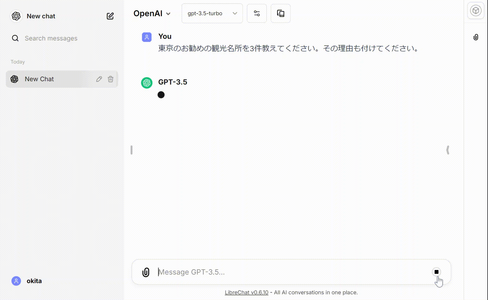

# WindowsでLLM

LLMを始めたいが、AzureやOpenAI APIは有料だし、自前でやるにもGPUが無い人のために、手持ちのPCでLLM環境を構築する手順。  

PCは、Winddows10、Core i5、メモリ16GB、空きストレージ 30GB以上が目安。

## 1. [WSL/llama-cpp-python編](1.WSL_llamacpp)
WindowsにWSLをインストールし、llama-cpp-pythonのサーバをDockerで動かすまでの手順。  

### 1.1 WSL GPU編
WSLでGPU（NVidia）を使うためのインストール手順

## 2. [Python/Jupyter/OpenAI編](2.python_jupyter_openai)
WSLにPython環境を構築して、Jupyter LabからOpenAI APIを使用し、llama-cpp-pythonサーバにアクセスするまでの手順。

### 2.1 [llama-cpp-pytho直起動編](2.python_jupyter_openai/2.1.llama-cpp-python.md)
Dockerを使わずに、llama-cpp-pythonをWSLから直接起動するための手順。

## 3. [LibreChat編](3.librechat)
Chat UIでローカルChatGPTっぽい環境を構築する。UIは[LibreChat](https://github.com/danny-avila/LibreChat)を
使用し、llama-cpp-pythonサーバのLLMに接続する手順。

LLM実行委員会